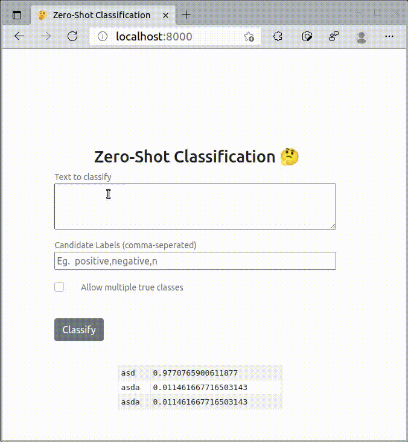

# Getting Started
- Create a virtual environment
```
python3 -m venv env
```

- (Unix) Activate the environment
```
source env/bin/activate
```
- (Windows) Activate the environment
```
env\Scripts\activate.bat
```

- Install requirements
```
pip install requirements.txt
```

- Set the model you want to use from environment variable, you can create a `.env` file with the following format
```
ZSL_MODEL=typeform/mobilebert-uncased-mnli
```

- Run the server using uvicorn
```
uvicorn main:app
```

# Demo
  
This demo uses the following model: [vicgalle/xlm-roberta-large-xnli-anli](https://huggingface.co/vicgalle/xlm-roberta-large-xnli-anli)